<h2>first_app : Ma Première Application Flutter</h2>

<h3>Des fonctionnalités incluses</h3>

<ul>
<li>
Système de navigation avec un menu Drawer.
</li>
<li>
Changement dynamique du thème en utilisant Bloc.
</li>
</ul>

 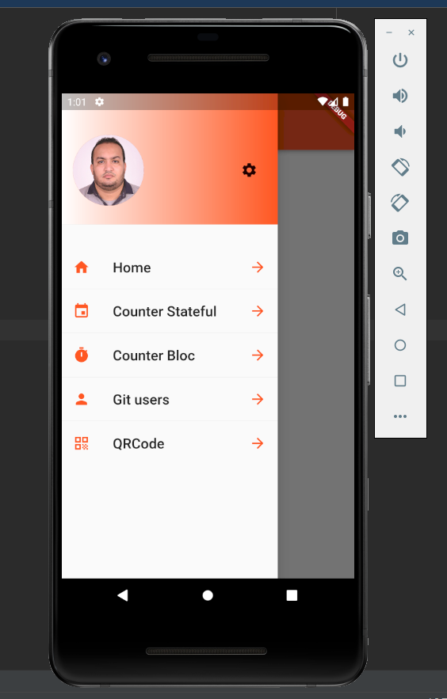
 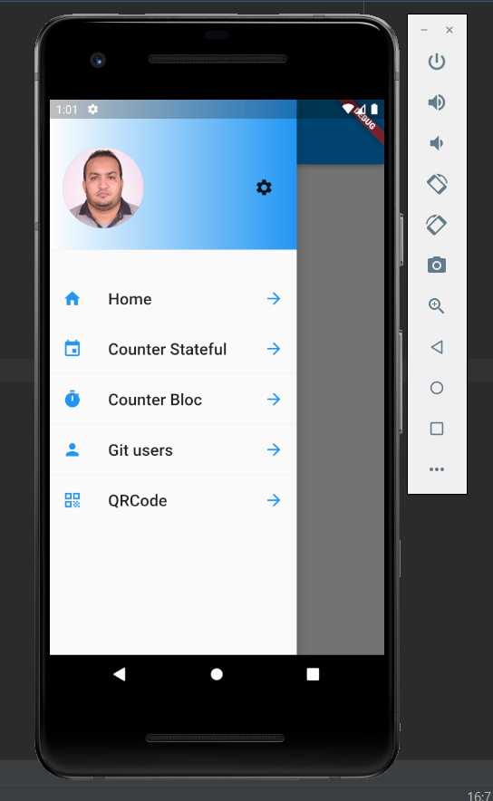
 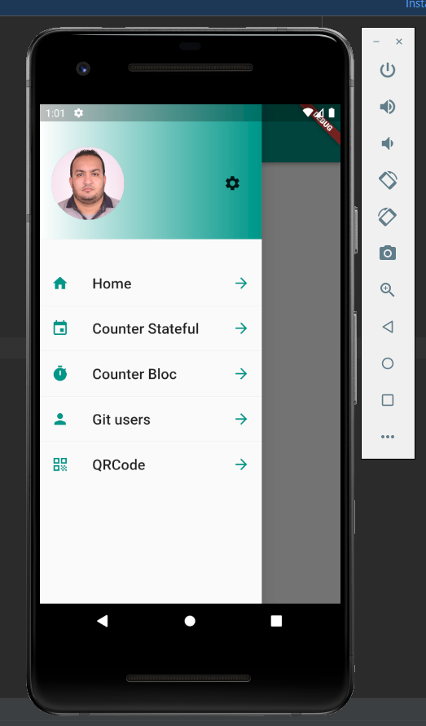

	<h3>Les pages principales</h3>
<ul>
<li>
Home page
</li>
<li>
Une page qui permet d'incrémenter et de décrémenter un compteur en utilisant Stateful widget
</li>
<li>
Une page qui permet d'incrémenter et de décrémenter un compteur en utilisant Bloc Pattern
</li>
</ul>

 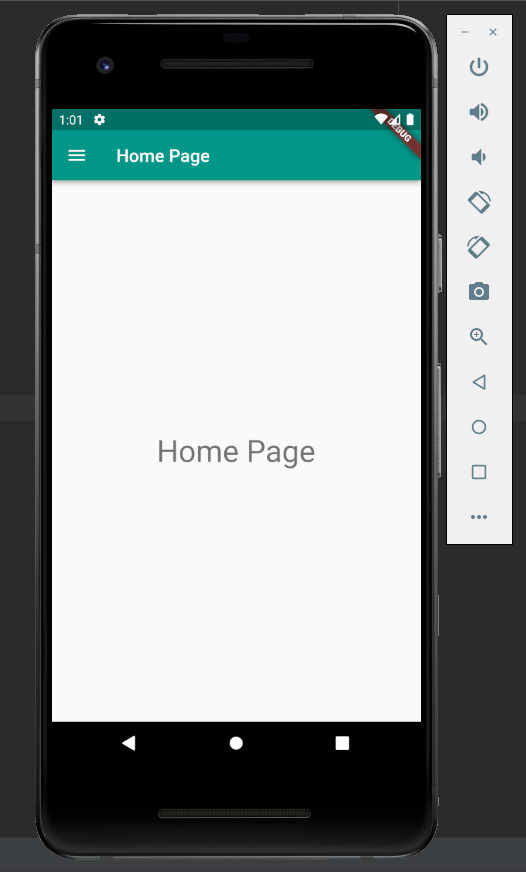
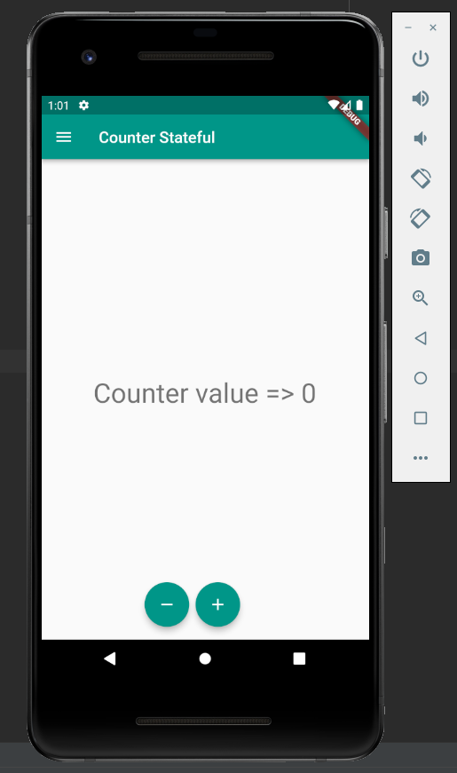
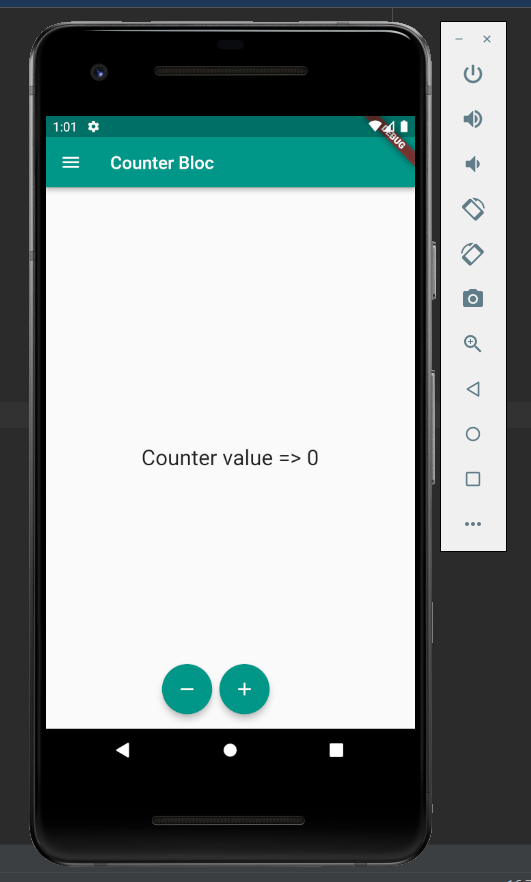

<ul>

<li>
Une page qui permet de chercher les utilisateurs Git Hub en utilisant l'API Git Hub avec l'utilisation de Bloc
</li>
<li>
Une page qui permet d'afficher les repositories git hub d'un utilisateur sélectionné.
</li>
</ul>

 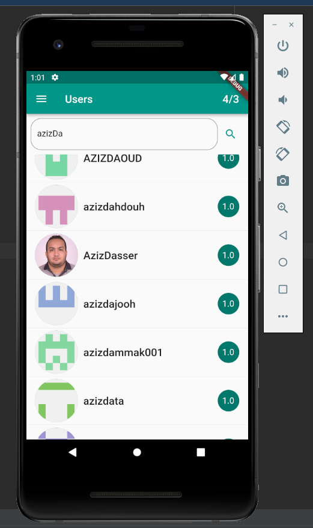
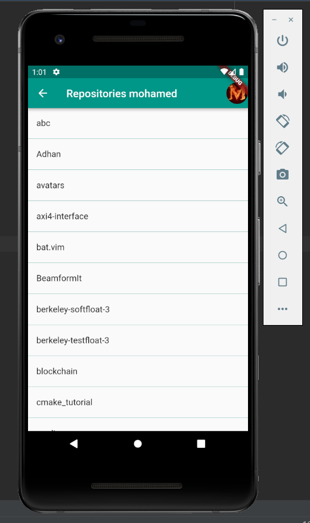

 
<li>
Une page qui permet de lire et gêner QRCode.
</li>
 
</ul>

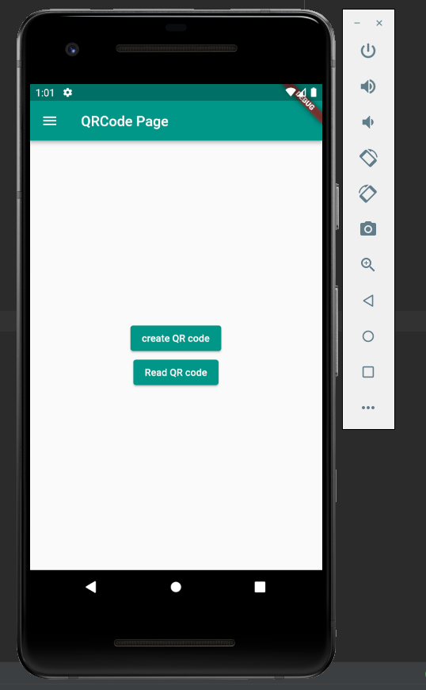
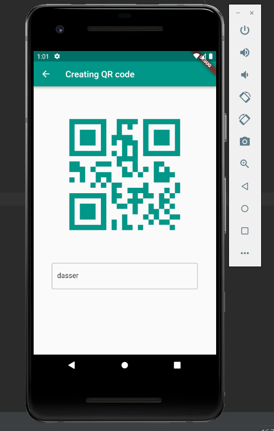
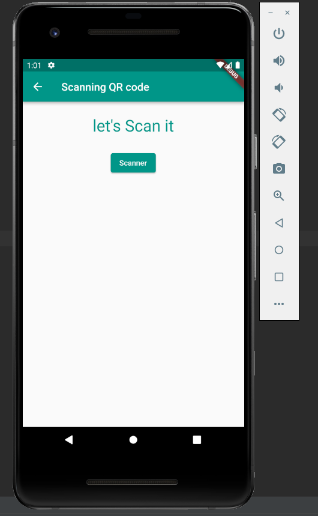

 

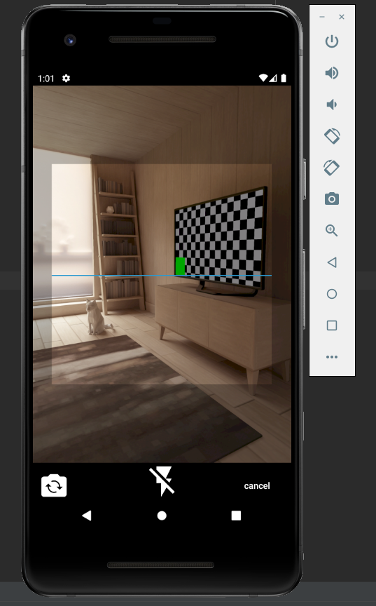
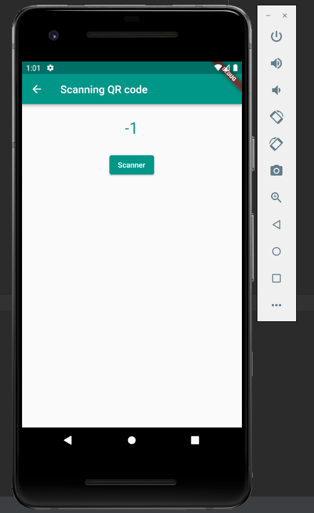

